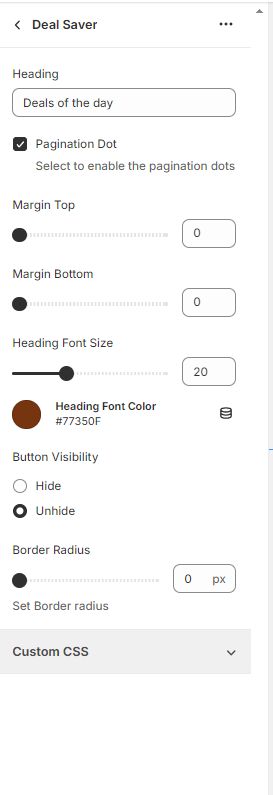

# Component Parallax Image Text

This component provides a basic outline with minimal styling. To ensure it matches your design specifications, additional custom styling may be required.

# Preview

## Features

**General Options**

- [x]  Section padding option (0-100)
- [x]  Option to add subheading and heading text
- [x]  Option to choose text alignment
- [x]  Option to choose image height (Desktop and Mobile)

**Image Options**

- [x]  Option to add Before image (Desktop and Mobile)
- [x]  Option to add After image (Desktop and Mobile)

## Dependencies

 - None

## Implementation Steps

 - ### Step 1: 
   Create a section named `marmeto-image-text.liquid` under `sections directory` and copy paste the section code
   
 - ### Step 2: 
   Create a section named `marmeto-image.liquid` under `snippets directory` and copy paste the snippet code
     

# Important Notes

>  The component employs its own styling. For further styling, consider adding your own CSS